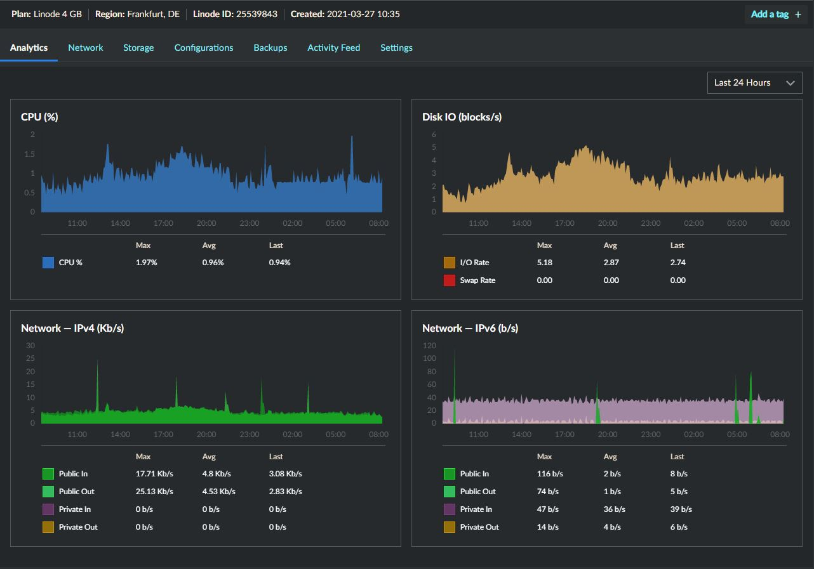
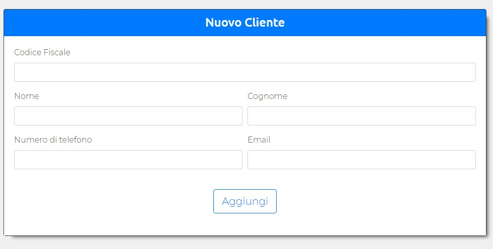
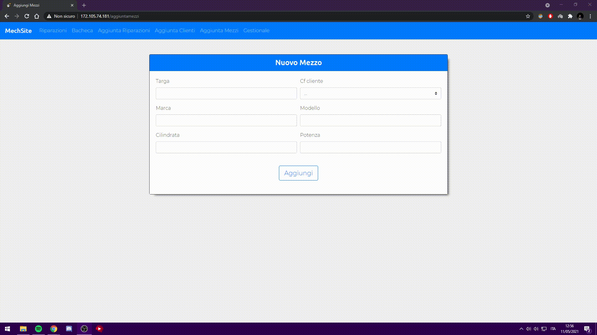
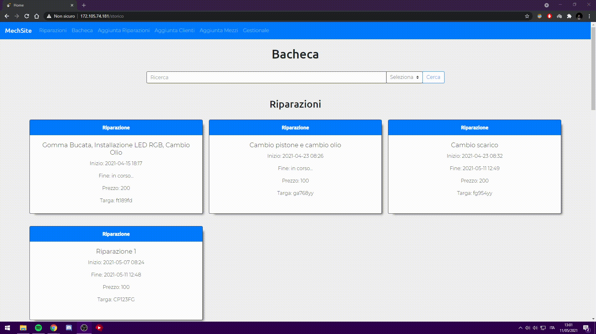
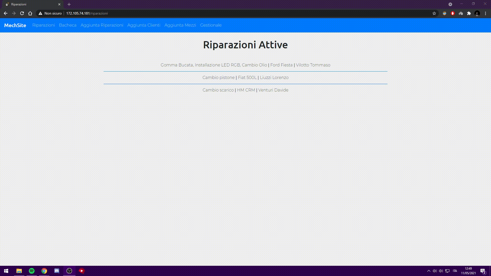
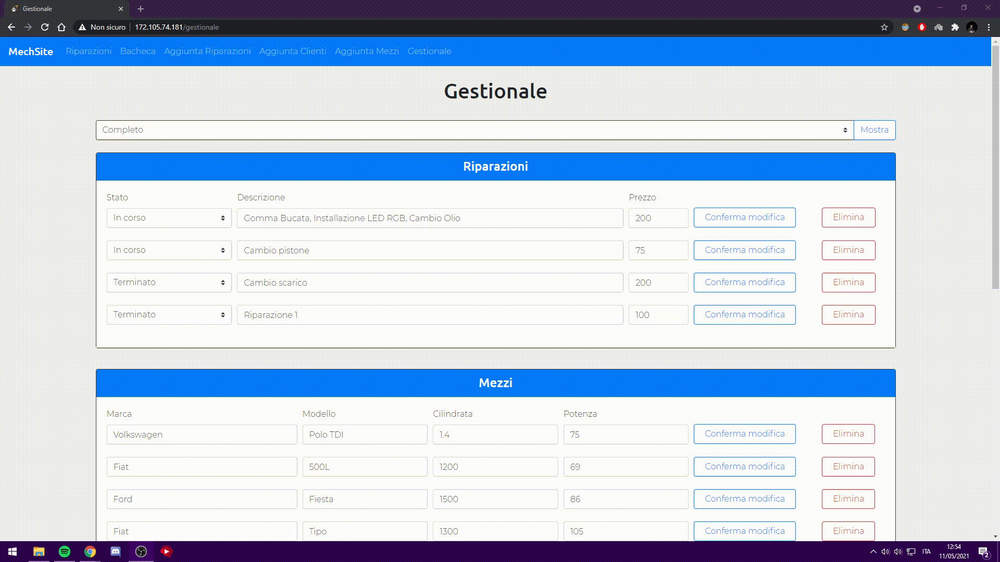
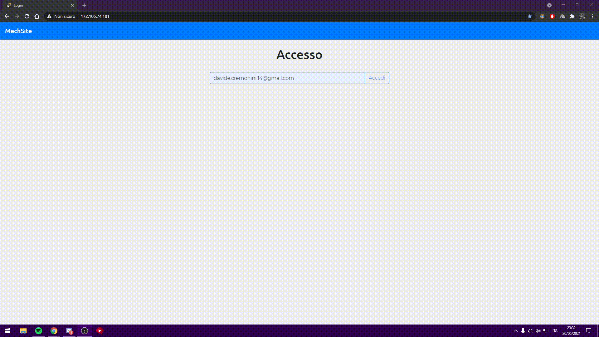
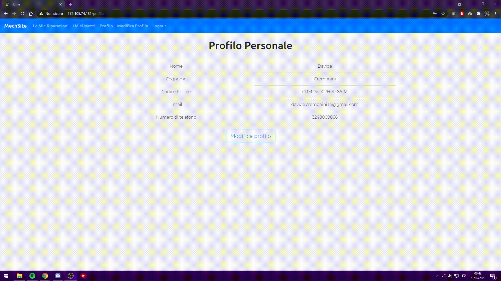

# MechSite

## Index
  - [Status del progetto](#status-del-progetto)
  - [Descrizione](#descrizione)
  - [Documentazione](#documentazione)
  - [Tecnologie](#tecnologie)
  - [Linguaggi](#linguaggi)
  - [Architettura](#architettura)
  - [Funzionalità](#funzionalità-della-piattaforma)
  - [Licenze](#licenza)

## Italiano

## Status del progetto
In fase di completamento

## Descrizione
MechSite è una piattaforma sviluppata per la semplificazione del lavoro e della gestione di un'Officina Meccanica.
Sviluppo a cura di Aldegheri Alessandro, Cremonini Davide, Liuzzi Lorenzo e Venturi Davide.

## Documentazione

* [Diagramma di Gantt](https://drive.google.com/file/d/1BeVnqbh5HKW09XOT5dUjtl3Uy1bokWgN/view?usp=sharing)
* [Tabella RACI](https://docs.google.com/spreadsheets/d/1kEPLzwxoObNCef1DimVPtG-wvmlK6mBi6TJlE5SkUkk/edit?usp=sharing)
* [Work BreakDown Structure](https://drive.google.com/file/d/1zb6he1vLRaxeQFNN8-heSKB_FlnQ6TEn/view?usp=sharing)

## Tecnologie

* [Flask](https://flask.palletsprojects.com/en/1.1.x): Version 1.1.2
* [Bootstrap](https://getbootstrap.com): Version 5.0
* [SQLAlchemy](https://www.sqlalchemy.org): Version 1.4
* [Git](https://git-scm.com): Version 2.31.1

## Linguaggi

* [Python](https://www.python.org): Version 3.8.6
* [Html](https://html.com): Version 5
* [CSS](https://www.css.com): Version 3
* [JavaScript](https://www.javascript.com): Version ECMAScript 2018

## Architettura

Per la pubblicazione della piattaforma abbiamo optato per l'utilizzo del servizio di Hosting [Linode](https://www.linode.com/). Tramite un Link d'invito abbiamo potuto usufruire di due mesi di utilizzo gratuito. Successivamente, abbiamo configurato una macchina Ubuntu (20.10) dotata di 2 CPUs, 4 GB Ram, 80 GB Storage.
Tutta la configurazione è stata effettuata tramite l'utilizzo del software Putty e il protocollo SSH.

## Funzionalità della piattaforma

La piattaforma è divisa in due sezioni principali:
* Lato Amministrativo
* Lato Cliente

### Lato Amministrativo

All'interno della parte amministrativa saranno disponibili le seguenti funzionalità:
* Aggunta nuovi clienti
* Aggiunta nuovi mezzi
* Aggiunta nuovi interventi
* Visualizzazione di una bacheca che contiene tutti i clienti, i mezzi e gli interventi
* Visualizzazione di una pagina che contiene tutte gli interventi in corso nella quale è possibile terminare gli interventi attivi
* Possibilità di modifica e eliminazione dei dati relativi ai clienti, ai mezzi e agli interventi

#### Aggunta nuovi clienti
All'arrivo di un nuovo cliente l'amministratore potrà utilizzare i dati forniti da quest'ultimo per poterlo inserire all'interno del database.

#### Aggiunta nuovi mezzi
Per l'aggiunta di un nuovo mezzo all'interno del database sarà necessario specificare oltre alle informazioni del mezzo anche il codice fiscale del proprietario.
Il codice fiscale a differenza degli altri dati non sarà da inserire manualmente, ma sarà selezionabile da una lista di codici fiscali già esistenti.
Se il codice fiscale del proprietario non fosse presente sarà possibile selezionare la voce apposita che reindirizzerà alla sezione dedicata per aggiungerlo.

#### Aggiunta nuovi interventi
Per l'aggiunta di un nuovo intervento sarà necessario specificare oltre alle informazioni dell'intervento anche la targa del mezzo collegata ad esso.
Anche in questo caso, la targa del mezzo, a differenza degli altri dati non sarà da inserire manualmente, ma sarà selezionabile da una lista di targhe già esistenti.
Se la targa del mezzo non fosse presente sarà possibile selezionare la voce apposita che reindirizzerà alla sezione dedicata per aggiungerla.

#### Visualizzazione di una bacheca che contiene tutti i clienti, i mezzi e gli interventi
Per il personale amministrativo sarà possibile visualizzare in un unica pagina tutti i clienti, i mezzi e gli interventi registrati.
Sarà anche possibile una ricerca specifica tramite l'inserimento di un codice fiscale o di una targa. 

#### Visualizzazione di una pagina che contiene tutte gli interventi attivi
In questa sezione verranno visualizzati tutti gli interventi attivi e sarà possibile terminarli. Al momento della conclusione verrà inviata una mail di avviso al proprietario del mezzo interessato.
La pagina si presenta come una lista, dalla quale sarà possibile selezionare un intervento specifico per visualizzare più informazioni o terminarlo.

#### Possibilità di modificare i dati relativi ai clienti, ai mezzi e agli interventi
Il personale amministrativo potrà anche modificare i dati relativi ai clienti, ai mezzi e agli interventi già presenti nel database.
Queste operazioni saranno disponibili nella pagina gestionale.

### Lato Cliente

All'interno della parte dedicata al cliente le funzionalità saranno diverse.
Esse saranno limitate alla visualizzazione degli interventi collegati ad esso, dei mezzi a lui appartenenti e alla modifica dei propri dati personali con i quali è possibile effettuare l'accesso alla piattaforma.

Al primo accesso, utilizzando la mail fornita in precedenza al personale dell'officina, sarà richiesta la creazione e l'inserimento di una password che sarà utilizzata poi per tutti gli accessi successivi.

Questa password sarà poi modificabie all'interno dell'area dedicata alla modifica del profilo, dove saranno modificabili inoltre  i contatti email e numero di telefono.

## Licenza

### Licenza generale
MIT License

### Autori e copyright
| Autori  | Contatto di posta elettronica |
| ------------- | ------------- |
| Aldegheri Alessandro  | 18134@studenti.marconiverona.edu.it |
| Cremonini Davide  | 18213@studenti.marconiverona.edu.it |
| Liuzzi Lorenzo  | 18298@studenti.marconiverona.edu.it |
| Venturi Davide  | 18438@studenti.marconiverona.edu.it |
